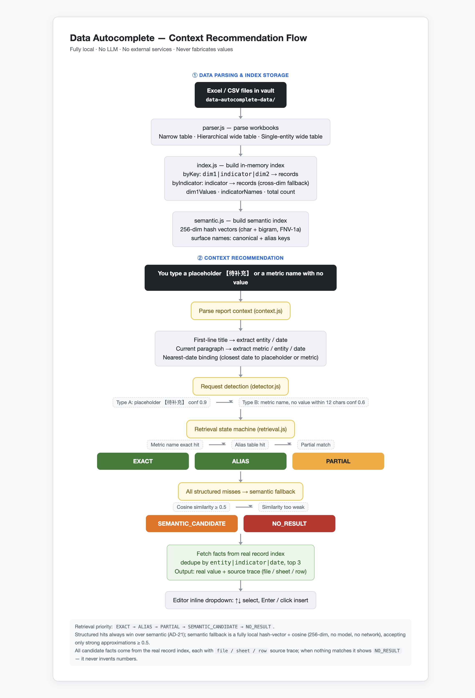

# Data Autocomplete

A fully local data autocomplete engine for Obsidian: it parses Excel/CSV files inside your vault and retrieves real values by report context, with forced source tracing. No external services, no LLM, no Python backend — your data never leaves the vault.

- Version: **0.1.8**
- Category: Desktop plugin (`isDesktopOnly: true`)
- Install: copy this folder to `<vault>/.obsidian/plugins/data-autocomplete/`, then enable it in Settings → Community plugins (turn off restricted mode).

---

## What it does

When writing reports or documents, you often need to fill "metric name + value" into the text. This plugin automates that:

1. Put your Excel/CSV files into the vault's data directory (default `data-autocomplete-data/`);
2. While writing, mark missing data with a placeholder (e.g. `本月试驾量为【待补充】`), or just write the metric name without a value;
3. The plugin parses the **report context** (first-line title + current paragraph) to extract "metric / entity / date", then retrieves candidate values from **real data**;
4. Every candidate carries a **source trace** (file / sheet / row number). If nothing matches, it shows `NO_RESULT` — it **never fabricates values**.

It depends on no external service. Data stays inside the vault and works fully offline.

## How the context recommendation works

When you type a placeholder (`【待补充】`) or a metric name without a value, the plugin runs a **5-stage retrieval state machine** — it never invents numbers:



**Retrieval priority**: `EXACT → ALIAS → PARTIAL → SEMANTIC_CANDIDATE → NO_RESULT`. Structured hits always win over semantic (AD-21); the semantic fallback is a fully local hash-vector + cosine similarity (256-dim, no model, no network), accepting only strong approximations ≥ 0.5 to prevent weak substring overlaps from creating misleading candidates. All candidate facts come from the real record index, each with `file / sheet / row` source trace.

## Demo

Watch a short demo of the plugin in action (placeholder completion, wavy-underline + dropdown, source tracing):


Or download it directly: [demo.mp4](docs/demo.mp4)

## Install (3 steps)

1. **Add data**: create a `data-autocomplete-data/` folder in your vault root and put Excel/CSV files inside (supported layouts:
   - Narrow table: `dimension1/dimension2/month/metric/value/metric description`
   - Hierarchical wide table / single-entity wide table: row 1 headers (`…/specific metric/metric description/entity`), row 2 date columns (`累计值`/`2026-07月数据`/ranking columns), data starts from row 3)
   - The directory name can be changed in settings.
2. **Install the plugin**: copy this folder to `<vault>/.obsidian/plugins/data-autocomplete/`, then enable it in Settings → Community plugins (turn off restricted mode).
3. **Rebuild the index**: run **「重建数据索引（解析 vault 内 Excel/CSV）」** from the command palette, or click "Rebuild index" on the settings page.

## Usage

- Mark missing data with placeholders while writing, for example:

  ```text
  华东区 2026年7月经营数据

  本月试驾量为【待补充】，成交量为【待补充】，客流量是【待补充】。
  客单价【待补充】，单车毛利为【待补充】，成交率【待补充】。
  ```

- Run **「分析当前笔记（数据自动补全候选）」** (`Ctrl/Cmd+P`), and a popup lists every data request:
  - Request type (`placeholder` / `metric_no_value`), confidence, metric word, original sentence
  - Parsed dimensions: metric (match mode) · entity (scope) · date (scope) · missing item
  - Retrieval status (`EXACT` / `ALIAS` / `PARTIAL` / `NO_RESULT`) with explanation
  - Each candidate fact: **real value + entity + date + match mode + source trace (file/sheet/row)**
  - "Copy candidate text" writes it into the note in one click.

- `NO_RESULT` is a **normal path**: it means there is no matching record in the real data. This plugin never invents numbers.

## Commands

- `重建数据索引（解析 vault 内 Excel/CSV）` — rebuild the data index
- `分析当前笔记（数据自动补全候选）` — analyze the current note for autocomplete candidates
- `数据索引概览` — data index overview
- `手动搜索数据（查询理解 + 排序）` — manual search with natural-language query understanding and ranking
- `数据预览：单主体单指标全部历史` — preview all history for one entity + one metric
- `浏览数据：全量明细分页` — browse all records with pagination
- `多表管理：切换活跃数据表` — switch the active data table (each subfolder = one named table)
- `创建数据备份（打包数据目录）` — back up the data directory as a zip
- `恢复最新备份` — restore from the latest backup
- `确保数据目录存在（幂等）` — ensure the data directory exists (idempotent)
- `一键补全全部占位符（auto/manual/nodata）` — fill all placeholders in one pass (auto / manual / nodata)
- `展开省略号为【待补充】占位符` — expand ellipses (`。。。`/`...`/`……`) into placeholders

## Settings

### Data source & basics
- **Data directory**: default `data-autocomplete-data` (relative to vault root)
- **Auto-rebuild index on startup**: parse automatically when the vault opens (default on)
- **Rebuild index now**: rebuild manually after data files change (or use the command palette)

### Retrieval & semantics
- **Semantic fallback (approximate match, fully local)**: when structured retrieval misses, use local hash-vector approximation to find metrics, then query real data; turn off for strict structured matching only
- **Semantic candidate count**: how many candidate metrics the semantic fallback shows (default 3)
- **Semantic hit threshold**: below this similarity, "approximate metrics" don't count as hits (default 0.5)

### Editor completion & detection
- **Inline completion (placeholder + metric-name dropdown)**: typing `【` shows a real-data candidate dropdown in place (↑↓ to select, Enter/click to insert and auto-close `】`); typing a metric-name prefix (e.g. `成交`/`本月成交`) pops up a metric-name dropdown, Enter completes the name (default on)
- **Type-B missing-value detection (wavy underline + Tab/dropdown completion)**: when a metric name has no value within 12 characters, candidates are generated: a red wavy underline under the metric name; when the cursor stops at the end of the metric name, a **real-value candidate dropdown** pops up (↑↓ to select, Enter/click to insert); Tab inserts the first candidate directly
- **Record completion history**: every popup copy / inline insert appends a line to `数据目录/history.jsonl`

## Local self-test

```bash
# Engine regression tests against real data (no Obsidian needed, plain node)
node test/engine.test.mjs
```

Current engine 25 assertions, wavy-mark 9 assertions, dropdown 29 assertions all pass: narrow table 1008 records, hierarchical wide table 498 records, single-entity wide table 10 entities × 20160 records, 21666 real records total / 13 entities / 263 metrics; all 7 placeholders in the sample note hit `EXACT` real values (试驾量 235.3, 成交量 35.2, 客流量 1086.5, 客单价 301569.4, 单车毛利 42552.6, 成交率 11.2, 总利润 8127), each with `file/sheet/row` source trace.

## Development

```bash
npm install          # esbuild + xlsx
npm run build        # src/main.js → single-file main.js (2.1MB, includes xlsx)
npm run test:engine  # engine regression
node test/marks.test.mjs    # wavy-mark + Tab chain
node test/dropdown.test.mjs # dropdown decision
```

Module layout (mirrors the Python pipeline):
`parser.js` (narrow/hierarchical wide tables) → `index.js` (in-memory index) → `context.js` (context/entity/date/metric extraction) → `detector.js` (placeholder/metric-missing detection) → `retrieval.js` (EXACT→ALIAS→PARTIAL→NO_RESULT) → `engine.js` (orchestration, output shaped like the Python `/analyze-report`).

## M2: Semantic fallback (implemented in this version)

When structured retrieval (exact/alias/partial) all miss, semantic fallback kicks in:

1. **Local hash-vector + cosine** (`semantic.js`): embed metric "surface names" (canonical name + alias keys) as 256-dim unit vectors via character/bigram hashing; embed the query the same way, compute cosine, take top-3.
2. **Threshold gating**: cosine ≥ 0.5 to accept a candidate, preventing weak substring overlaps (e.g. `人数`/`数量`) from creating misleading approximations (`外星人数量` always stays `NO_RESULT`).
3. **Structured always wins** (AD-21): semantic only acts as `SEMANTIC_CANDIDATE` fallback after EXACT → ALIAS → PARTIAL all fail; candidate facts still come from the real record index (`lookupMetric`) — **never generates values**.
4. **Can be disabled**: the "semantic fallback" toggle in settings; when off, only strict structured matching.

New status `SEMANTIC_CANDIDATE` (shown in orange in the popup), retrieval order: `EXACT → ALIAS → PARTIAL → SEMANTIC_CANDIDATE → NO_RESULT`.

Example: note writes `本月到店人数为【待补充】` → semantic layer hits `进店人数` (0.71) → normalized to `客流量` → returns real value 1086.5 (2026-07, 经营数据-示例.xlsx row 76).

## M3: Editor inline completion (implemented in this version)

When you type the placeholder `【`, a candidate card pops up in place (`src/editor/inlineSuggest.js`, CodeMirror 6):

- **Candidates**: `Engine.suggest(cursor-prefix)` reuses the full pipeline — it automatically combines the note's first line (entity/date title) + the paragraph before the cursor into a query segment, then runs request detection → structured → semantic fallback;
- **Interaction**: `↓/↑` to switch candidates, **Enter** or **click** inserts the real value and auto-closes `】`, `Esc` closes;
- **Trace visible**: each candidate shows `value metric@date entity (file:row)`; status/explanation in the title line (EXACT/ALIAS/PARTIAL/SEMANTIC_CANDIDATE/NO_RESULT).
- **Never fabricates**: when nothing matches it shows `NO_RESULT` instead of forcing a number.

Toggle in settings (default on). CodeMirror packages are injected by the Obsidian runtime (`build.mjs` marks them external, not bundled).

## Roadmap

- **M4 Wide-table column recognition**: auto-detect and fold arbitrary entity matrices (entity × metric × month).
- **M5 Candidate history & frequent metrics**: record every pick, weight future ranking.

## License

MIT License — see [LICENSE](LICENSE).
